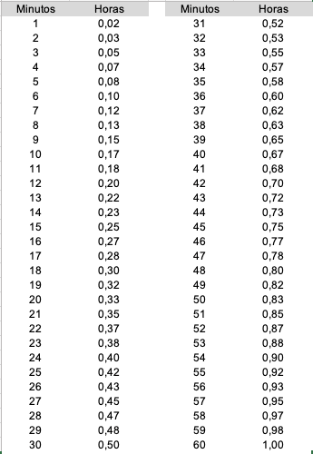

# Conversor de Horas
## Objetivos
Ajudar Pessoas a fazer a contagem de horas nos sistemas
* Ajudar na coversão de um sistema para outro para lançamento de horas
* Ajuda a totalizar as horas do mês com base nos dias
* Ajuda a mostrar a quantidade de horas que falta para finalizar o mês

---

## Como?
Fazer uma aplicação de terminal (CLI) ou (GUI) que perguntando uma lista de horários especifios ele responde uma tabela especificando as datas ou horários.

---

## Tipos de conversões
Todos os tipos de conversoes possiveis:
* Tipos de Horas: 12:30 ou 12.5 sendo as duas correspondentes
```bash
converte-horas -h "12:30"
```
```bash
hora: "12.5"
```


* Horas semanais: {[seg, nm, 9],[ter, nm, 9],[qua, nm, 9],[qui, nm, 9],[sex, nm, 9]} = Total 44 horas semanais
```bash
converte-horas -s "{[seg, nm, 9],[ter, nm, 9],[qua, nm, 9],[qui, nm, 9],[sex, nm, 7]}"
```
```bash
total horas da semana: 43:00
total horas extra: 00:00
total horas faltantes: 1:00
```
* Horas semanais Mais horas extra: {[seg, nm, 9],[ter, nm, 9],[qua, nm, 9],[qui, nm, 9],[sex, nm, 9]} = Total 43 mais 2 horas extra
```bash
converte-horas -s "{[seg, nm, 5],[ter, ex, 2],[ter, nm, 8],[qua, nm, 10],[qui, nm, 10],[sex, nm, 10]}"
```
```bash
total horas da semana: 43:00
total horas extra: 02:00
total horas faltantes: 1:00
```
* Horas Mensal Total: [44,44,44,44,27] = 203 horas Totais em 1 Mês
```bash
converte-horas -m "[44,44,44,44,27]"
```
```bash
total de horas esperadas no mes: 203:00
total horas trabalhadas: 203:00
total horas faltantes: 00:00
```
* Hora X - Y qual valor total de horas.
```bash
converte-horas -r "['12:30','12:50']"
```
```bash
Total diferença de horas: 00:20
```
* Hora X + Y qual valor total de horas.
```bash
converte-horas -c "['1:30','1:00']"
```
```bash
Total de horas: 02:30
```
* Calcula uma Interjornada +11 horas.
```bash
converte-horas -i "14:00"
```
```bash
Hora: 00:00
```
